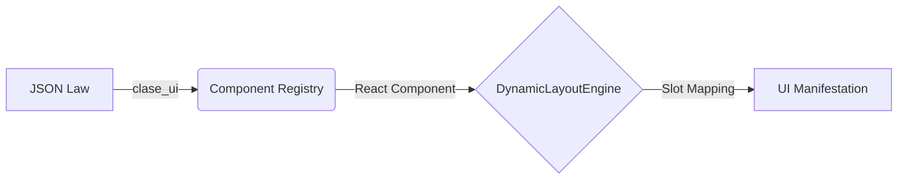

# 🏛️ Capa 0: Andamiaje Canónico de Renderizado (SDUI 2.0)

Este documento define la norma maestra para la manifestación visual de INDRA OS. Basado en el estándar de **Interfaces Dinámicas por Metadatos**, este modelo asegura una consola industrial resiliente, elástica y determinista.

## 1. El Axioma del Espacio (Continuous Flex Chain)

Para evitar el colapso visual (pantallas negras o contenido cortado), INDRA utiliza una **Cadena de Flexión Continua**. Ningún componente puede tener una altura "automática" si eso rompe la herencia desde el Shell.

### La Jerarquía de Altura:
1. **The Root (`#root`)**: Forzado a `100vh`.
2. **The Shell (`axiom-shell`)**: Contenedor Flex principal.
3. **The Slot (`axiom-slot`)**: Cada ranura (sidebar, canvas) posee `flex: 1` y `overflow: hidden`.
4. **The Module (`clase_ui`)**: Ocupa el 100% del slot mediante Flexbox, nunca mediante medidas fijas en PX.

> [!IMPORTANT]
> **Regla de Oro**: Si un componente no es visible, el 99% de las veces es porque se rompió la cadena de `flex: 1` o `height: 100%` en un nivel intermedio.

---

## 2. El Proceso de Transmutación (Data-to-UI)

El renderizado no es un mapeo de nombres de archivos, sino una resolución de **Contratos Legales**.

### Flujo de Ignición:
1. **JSON Law**: Define la intención (`clase_ui: "IDENTITY_DASHBOARD"`).
2. **Component Registry**: Actúa como el oráculo que traduce la intención en Matter (React).
3. **DynamicLayoutEngine**: Inyecta el componente en el Slot correspondiente según el mapa de distribución.

---

## 3. Hidratación Recursiva (Materia y Sense)

Para garantizar la sincronía industrial, INDRA prohíbe el "Sensing" fragmentado en átomos de bajo nivel.

- **El Grupo como Hidratador**: El `AxiomaticGroup` es el responsable de pedir datos al `SovereignBridge`.
- **Átomos Pasivos**: Los botones, etiquetas y selectores reciben datos puros (`props`).
- **Hidratación de Átomo**: Solo si un átomo tiene una `data_source` explícita, el motor realizará una hidratación local coordinada, pero nunca de forma asíncrona dentro de la lógica del componente visual.

---

## 4. Diccionario de Clases UI (Soberanía)

Cualquier nuevo módulo debe registrarse obligatoriamente en `src/core/engine/ComponentRegistry.js` bajo una de estas categorías canónicas:

| Clase UI | Propósito | Ejemplo OMD |
| :--- | :--- | :--- |
| `IDENTITY_DASHBOARD` | Gestión de cuentas y soberanía. | OMD-02 |
| `FLOW_CANVAS` | Lienzo interactivo de orquestación. | OMD-03 |
| `NEURAL_COPILOT` | Interfaz de lenguaje natural y IA. | OMD-04 |
| `CONTEXT_INSPECTOR` | Inspección profunda de estados. | OMD-05 |

---

## 5. Prevención de Entropía Visual
- **No use `!important`**: El layout debe ser fluido por diseño, no por fuerza.
- **Scroll Interno**: El desbordamiento (`overflow`) siempre debe ser gestionado dentro del módulo, nunca permitiendo que el Shell principal genere una barra de scroll global.
- **ResizeObserver**: Use observadores de tamaño para que los componentes se adapten al ancho del sidebar de forma reflexiva.

## 6. Protocolo de Ejecución de Voluntad (Mapeo Core)

Para que un componente sea interactivo, debe vincular sus intenciones con las capacidades reales del **Kernel**.

### El Atributo `action_core`
Todo átomo de tipo `ACTION` debe incluir la propiedad `action_core`, que sirve como identificador único para el dispatcher del `SovereignBridge`.

**Estándar de Nomenclatura**: `[MODULO]_[ACCION]_[OBJETO]`
- Correcto: `VAULT_CREATE_TOKEN_SESSION`
- Incorrecto: `save_data`

### Mapeo en el Bridge:
Cada `action_core` definido en el JSON debe tener un caso correspondiente en el método `executeAction` del `SovereignBridge.js`. Este método es la única vía autorizada para comunicarse con los servicios de Google Apps Script u otros adaptadores.

---

**Certificado por:** Arquitecto de Soberanía Visual
**Versión:** 2.1.0-CANONICAL

