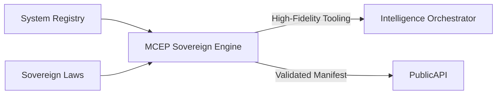

# 🛰️ Protocolo MCEP Sovereign (Model Cognitive Execution Protocol)

El motor **MCEP Sovereign** es la capa de traducción cognitiva de Indra OS. Su función es mediar entre el estado técnico del núcleo (Capa 1) y la capacidad de razonamiento de los modelos de IA (Intelligence Orchestrator).

## 1. Dharma del Componente

El MCEP no es un simple generador de listas de herramientas. Es un **traductor de realidad** que asegura que cualquier entidad cognitiva (IA) opere bajo los mismos axiomas que el núcleo técnico.

- **Agnosticismo de Interfaz:** Separa la definición de capacidad del canal de ejecución (PublicAPI).
- **Integridad Axiomática:** Inyecta leyes directamente en el ciclo de pensamiento de la IA.
- **Eficiencia de Contexto:** Digiere y filtra la información para minimizar el ruido y el consumo de tokens.

---

## 2. Arquitectura de Digestas Cognitivas

El protocolo se basa en el concepto de **Digestas**, fragmentos de leyes procesados para ser interpretados por modelos de lenguaje:

### A. Digestión de Leyes (On-Demand)
La IA ya no recibe toda la constitución de golpe. A través del método `digestLaws(scope)`, el sistema entrega fragmentos específicos:
- `logic`: Axiomas de decisión y listas blancas.
- `spatial`: Reglas de física gráfica y coordenadas 3D.
- `visual`: Gramática de diseño y tokens de estilo.
- `blueprints`: Contratos técnicos de entrada/salida.

### B. Mapeo de Capacidades (Soberanía ADN)
A través de `resolveCapabilities(systemContext)`, el MCEP filtra el catálogo de herramientas basándose en el **ADN Transaccional**:
1. Identifica el `accountId` y `spaceId`.
2. Verifica qué adaptadores están "vivos" para ese contexto.
3. Expone solo los métodos autorizados, garantizando aislamiento total entre titulares (Espacio Soberano compartido).

---

## 3. Integración en el Pipeline

## 4. Estándares de Implementación

Para que un nuevo componente sea "MCEP-Ready", debe cumplir con:
1.  **Esquemas IO:** Definición clara de inputs/outputs en `io_interface`.
2.  **Dharma Semántico:** Etiquetas `semantic_intent` y `archetype` para que el MCEP sepa explicarle a la IA para qué sirve la herramienta.
3.  **Anotaciones de Comportamiento:** Uso de `io_behavior` (GATE, STREAM, SCHEMA) para guiar el flujo de datos.

---

> [!TIP]
> El MCEP Sovereign es la clave para la **IA Auto-Gobernada**. Al darle acceso a las leyes, el sistema deja de "suponer" y empieza a "verificar" su propia lógica.
