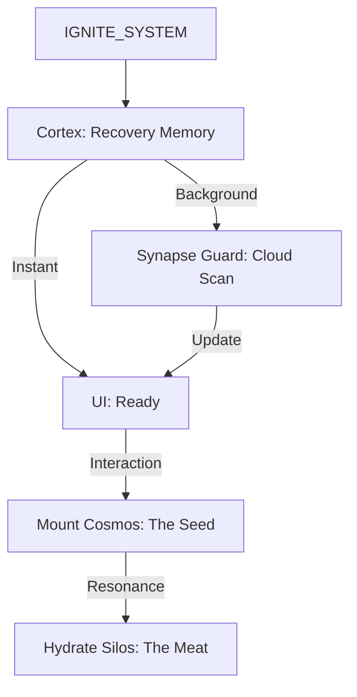

# COSMOS HYDRATION CANON v9.7
**Homeostasis: La Estrategia del Córtex, la Semilla y la Carne**

> **📍 ESTADO:** ✅ **ACTIVO Y BLINDADO** (2026-02-09.1)  
> **Axioma:** "La Semilla define la realidad, la Carne la habita, el Córtex la anticipa."

---

## 🏗️ 1. LA TRINIDAD DE LA INFORMACIÓN

Para alcanzar la fluidez absoluta, INDRA divide la realidad en tres capas:

### A. El Córtex de Memoria (The Brain Layer) - **NUEVO v9.6**
- **Naturaleza**: Cognitiva, proactiva, volátil + persistente.
- **Contenido**: Índices de descubrimiento (`availableCosmos`), estados de sincronización, semáforos de red.
- **Persistencia**: `localStorage` (`INDRA_CORTEX_CACHE_V1`) + RAM (`Map`).
- **Función**: Eliminar la latencia de "descubrimiento" y evitar peticiones duplicadas.

### B. La Semilla (The Seed)
- **Naturaleza**: Estructural, inmutable, ligera ($<100KB$).
- **Contenido**: Identidad, Layouts activos, IDs de conexión, punteros de flujo.
- **Persistencia**: Se guarda físicamente en Google Drive (`.cosmos.json`).
- **Función**: Garantizar que la UI encienda en **<200ms**.

### C. La Carne (The Meat)
- **Naturaleza**: Volátil, pesada, masiva (MBs).
- **Contenido**: Listas de archivos (Drive), páginas (Notion), emails, logs.
- **Persistencia**: **PROHIBIDO** en Drive. Habita exclusivamente el **L2 Cache** (IndexedDB / PersistenceManager).
- **Función**: Proveer la experiencia de datos sin latencia.

### D. El Reactor de Reconciliación - **NUEVO v9.7**
- **Naturaleza**: Motor de integridad referencial atómica.
- **Función**: Asegurar que los `temp_id` del Córtex se transmuten en IDs reales en todas las capas (UI, Cola de Sincronía, Relaciones) de forma atómica.
- **Ley**: Ver `Reactor de Reconciliacion.md`.

---

## ⚖️ 2. EL CICLO DE HOMEOSTASIS v9.7

El sistema se auto-regula mediante cinco procesos axiomáticos:

### 0. Génesis Sincrónico (The Hard Boot) - **MEJORA v9.7**
A diferencia de los nodos internos, la creación de un **Cosmos** (La Semilla) es sincrónica. 
- **Razón**: El `SessionGatekeeper` requiere una identidad real para anclar la realidad tras un refresh. 
- **Flujo**: UI Spinner --> Server Save --> ID Real --> Mount UI.

### I. Reflejos Autónomos (Ignition Discovery)
Al encender el sistema (`IGNITE_SYSTEM`), el `ContextClient` dispara la hidratación del Córtex.
- **SWR (Stale-While-Revalidate)**: Entrega instantáneamente lo que recuerda de la última sesión.
- **Silent Fetch**: Valida en segundo plano sin interrumpir la ignición visual.

### II. El Guardián de Sinapsis (Request Deduplication)
- Bloquea peticiones duplicadas al Core mediante un sistema de **Semáforos de Promesas**.
- Si el usuario abre el buscador mientras el sistema precarga, ambas acciones comparten la misma tubería de red.

### III. La Poda de Silos (Pruning)
Antes de cada auto-save al backend, el `AxiomaticStore` aplica un umbral de seguridad (`SILO_SAVE_THRESHOLD = 50`).
- Si un silo (ej: Notion) tiene >50 items, se **poda** totalmente del JSON de Drive.

### IV. Hidratación de Fondo (Resonancia)
Justo después de que la UI es visible, el sistema lanza la **Señal de Resonancia** a través del `PersistenceManager`.

---

## 🛰️ 3. FLUJO DE VIDA v9.6

---

## 🛠️ 4. ARTEFACTOS AFECTADOS

| Componente | Rol en Homeostasis v9.6 |
| :--- | :--- |
| **ContextClient.js** | **Córtex Maestro**. Gestiona SWR y Deduplicación de peticiones. |
| **AxiomaticStore.jsx** | **Cerebro**. Dispara el Reactor de Reconciliación. |
| **CortexLobe.js** | **Scrubbing Engine**. Ejecuta la limpieza de identidades. |
| **SyncOrchestrator.js** | **Intent Reactor**. Corrige colas de peticiones en vuelo. |
| **PersistenceManager.jsx** | **Gestor de Carne**. Carga proactiva de datos masivos. |

---

## 🚫 5. REGLAS PROHIBIDAS

- ❌ **Fetch en UI**: Prohibido hacer `adapter.call` desde un `useEffect` de componente para datos de contexto.
- ❌ **Persistencia Obesa**: Nunca permitas que el archivo `.cosmos.json` supere los 100KB.
- ❌ **IDs Temporales en Anclas**: Prohibido persistir un `temp_id` en el `LAST_ACTIVE_COSMOS_ID`.
- ❌ **Sincronía Bloqueante**: Solo permitida durante el **Génesis de Cosmos** o **Nuclear Purge**.

---
**Fin del Canon v9.7**
