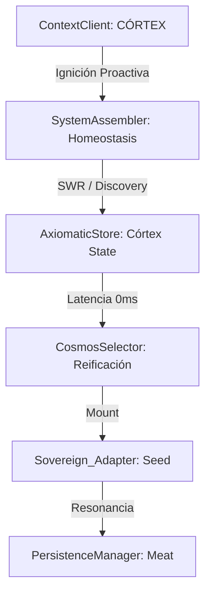
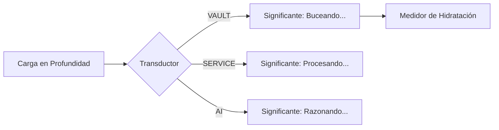

# Glosario de Leyes Axiomáticas (V8.3)

Este documento define las capas de información que componen el **ADN Digital** de un artefacto en INDRA OS. Estas leyes no son solo metadatos; son señales que el núcleo de React interpreta para materializar la interfaz de manera inteligente.

## I. Diccionario de Leyes (Contrato JSON)

| Ley (Key) | Definición Corta | Decisión de Renderizado (React) |
| :--- | :--- | :--- |
| **CÓRTEX** | Capa de memoria proactiva (Discovery & SWR). | Permite renderizado instantáneo de listas masivas usando la última "foto" conocida de la realidad. |
| **ID** | La Llave Nuclear de identidad (Pasaporte). | Requisito de seguridad; sin él, los motores de datos bloquean la proyección. |
| **LABEL** | Nombre funcional y público del artefacto. | Se proyecta como el título principal en el *Chassis* de la ventana. |
| **ARCHETYPE** | La naturaleza ontológica del objeto (su "clase" maestra). | Define el **Motor Primario** (Vault, Grid, Service) que se montará. |
| **ARCHETYPES** | Array de identidades múltiples (Polimorfismo). | Genera automáticamente una **Barra de Pestañas** para alternar vistas. |
| **DOMAIN** | Sector semántico al que pertenece (Data, Logic, System). | Determina el esquema de color y la iconografía del componente. |
| **CAPABILITIES** | Diccionario de herramientas y métodos expuestos. | Inyecta dinámicamente puertos en los nodos y botones en la barra de herramientas. |
| **VITAL_SIGNS** | Indicadores de salud y telemetría en tiempo real. | Proyecta medidores, barras de carga y alertas de estado en el panel lateral. |
| **UI_LAYOUT** | Flags de configuración para la "carrocería" visual. | Activa o inhibe paneles (Sidebars, Terminals) según la necesidad del objeto. |
| **PERSISTENCE** | Estrategia de cacheo y vida en memoria (TTL). | El `PersistenceManager` decide si muestra datos locales o dispara un spinner. |
| **DATA_CONTRACT** | Estándar de comunicación técnica que el objeto "habla". | Permite que una herramienta (ej: Inbox) sepa si puede leer tus mensajes. |

---

## II. Comparativa de Señales (Interferencia de Capas)

| Ley | **Córtex (Brain)** | **Drive Adapter** | **Notion Adapter** | **Math Service** | **Sheet Adapter** |
| :--- | :--- | :--- | :--- | :--- |
| **ARCHETYPE** | `CORTEX` | `VAULT` | `VAULT / DOC` | `SERVICE` | `GRID` |
| **DOMAIN** | `SYSTEM` | `KNOWLEDGE` | `KNOWLEDGE` | `LOGIC` | `DATA` |
| **VITAL_SIGNS** | Recall & Sync | Storage & Latency | API Rate & Token | Precisión & Clock | API Quota & Calc Time |
| **UI SIGNAL** | Discovery instantáneo | Explorador de archivos | Editor de texto | Consola de Funciones | Tabla de celdas |

---

## III. Trazabilidad del Modelo de Renderizado

El sistema no usa `switch` ni `if` hardcodeados. El renderizado es una **interferencia de señales**:

### La Decisión Inteligente
1.  **Anticipación Córtex**: El sistema recupera la "memoria" del Córtex antes del renderizado, permitiendo que el usuario vea su entorno de trabajo sin esperar al servidor.
2.  **Detección de Arquetipo**: Si el `CANON` emite la señal `VAULT`, React busca en el `Archetype_Registry` el motor correspondiente.
3.  **Inyectores de Vida**: El motor especializado (ej: `VaultEngine`) lee los `VITAL_SIGNS` y los proyecta como indicadores reactivos.

> **Axioma v9.6:** En INDRA, la espera es una falla semántica. El sistema debe recordar la realidad para no tener que buscarla.

---

## IV. Ley de Significación (Capa de Transducción)

Para evitar la "Contaminación por Latencia", INDRA implementa una capa de **Transducción Semiótica**. Esta capa impide que cada componente interprete el estado de carga a su manera, centralizando la lógica de qué *significa* un dato para el usuario.

### El Modelo: Señal -> Transducción -> Significante

1.  **La Señal (Core):** Datos crudos como `hydrationLevel: 5` o `status: SCANNING`.
2.  **La Transducción (Store/Hook):** Un motor lógico que asocia la señal con un arquetipo.
3.  **El Significante (Skin):** El elemento visual (Color, Pulso, Texto) que el usuario percibe.

### Comparativa de Significantes por Arquetipo

| Arquetipo | Señal de Carga | Significante (Signifier) | Decisión de React |
| :--- | :--- | :--- | :--- |
| **CORTEX** | `Recall Memory` | **Recordando...** | Opacidad suave que se solidifica al sincronizar. |
| **VAULT** (Drive/Notion) | `% de Objetos` | **Hidratación** (Llenado) | `progress-bar` con pulso de resonancia. |
| **COMPUTE** (Math) | `ms de proceso` | **Latido** (Heartbeat) | Animación de `scale` en el ícono de estado. |
| **GRID** (Sheets) | `Batch Sync` | **Consistencia** (Check) | Spinner de "Compromiso de Datos" (Sync). |
| **MCEP** (AI/Logic) | `Token Stream` | **Pensamiento** (Fluido) | Gradiente animado en el borde del contenedor. |

### Flujo de Retroalimentación de Carga

**Decisión Arquitectónica (V8.3):**
Los componentes (Signifiers) **no deben** aplicar su propia lógica de significación. Deben suscribirse a la **Ley de Transducción** del Store. Si el Store dice que el estado es `SCANNING`, todos los elementos visuales (barra de tareas, panel lateral, terminal) deben emitir la misma señal visual de "Resonancia Profunda", garantizando que el usuario nunca pierda el hilo de la realidad técnica del sistema, incluso ante 1000 bases de datos.

