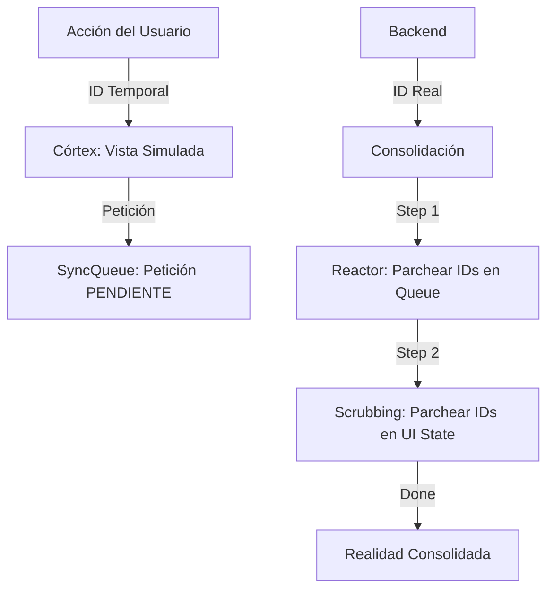

# ⚛️ REACTOR DE RECONCILIACIÓN v1.0
**Dharma: Integridad Referencial Atómica en Sistemas de Baja Latencia Simulada**

> **📍 ESTADO:** ✅ **OPERATIVO Y CANONIZADO** (2026-02-09)  
> **Axioma:** "Una mentira compartida (Temp ID) debe ser transmutada en verdad (Real ID) de forma atómica y universal."

---

## 🏗️ 🏗️ 1. LA PARADOJA DEL FANTASMA
En un sistema **Fat Client** con **Optimistic UI**, el usuario crea objetos que aún no existen en el servidor. Estos objetos reciben un `ID Temporal`.
El riesgo aparece cuando un objeto real intenta referenciar a uno temporal que acaba de ser reconciliado, creando una **Referencia Huérfana**.

---

## 🛠️ 2. LOS TRES PILARES DEL REACTOR

### I. El Escáner de Realidad (Cortex Scrubbing)
Situado en el `CortexLobe`, es un proceso recursivo que se dispara al recibir un nuevo ID real.
- **Función**: Busca el `tempId` en *todos* los rincones del estado:
  - `artifacts[]`: Actualiza el ID del nodo.
  - `relationships[]`: Actualiza IDs de origen, destino e ID de la relación misma.
  - `focusStack[]`: Mantiene la navegación fluida.
- **Garantía**: Un solo ciclo de CPU asegura que ningún componente React vea un ID viejo en el próximo render.

### II. El Reactor de Intenciones (In-Flight Reconcile)
Situado en el `SyncOrchestrator`, actúa sobre la cola de peticiones que aún no han salido al servidor.
- **Mecanismo**: Si tienes un "Crear Cable" en cola que apunta a un "Nodo Temporal", y ese nodo se vuelve real mientras el cable espera:
  - El Reactor hace un **Scrubbing Quirúrgico** del JSON del payload.
  - Reemplaza todas las ocurrencias del ID temporal por el real.
- **Garantía**: El servidor nunca recibe una petición con IDs temporales que ya han expirado.

### III. Génesis Sincrónico (The Boundary)
Define que ciertas acciones son demasiado críticas para ser simuladas.
- **Ley**: La creación del **contenedor Cosmos** es sincrónica. No existe `temp_id` para un universo entero.
- **Razón**: Evitar que el Gatekeeper intente anclar la sesión a una realidad inexistente tras un refresco de página.

---

## 🛰️ 3. DIAGRAMA DE FLUJO DEL REACTOR

---

## 🚫 4. LEYES DE SEGURIDAD

1.  **Prohibición de Snapshot**: Nunca se deben comparar estados antiguos. La reconciliación debe ser sobre el estado **vivo**.
2.  **Unidireccionalidad**: Un ID real nunca vuelve a ser temporal.
3.  **Atomicidad**: La propagación a artefactos y relaciones debe ocurrir en el mismo `dispatch`.

---
**Documento de Ley Indra OS - 2026**
