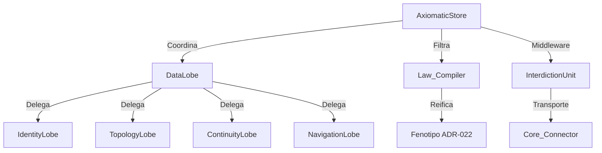

# MATRIZ RELACIONAL DE YONEDA: SISTEMA DE ESTADO AXIOM V15
**Versión:** 15.0 — Zen Alignment (ADR-022)

## 🧬 ANÁLISIS DE MORFISMOS Y EFECTOS CONCOMITANTES

### MAPA DE IDENTIDAD (Funtores Base)

```
F1: AxiomaticStore (React Context + Coordinator)
F2: AxiomaticState (Zustand - Autoridad Soberana)
F3: InterdictionUnit (Singleton - Membrana de Contención)
F4: SyncOrchestrator (Zustand - Preparador de Snapshots)
F5.1: IdentityLobe (Reducer - Gestión de Artefactos)
F5.2: TopologyLobe (Reducer - Gestión de Relaciones)
F5.3: ContinuityLobe (Reducer - Gestión de Sesión/Silos)
F5.4: NavigationLobe (Reducer - Gestión de Enfoque/UI)
F6: Law_Compiler (Refinería - Reificación Fenotípica)
F7: PersistenceManager (Gestor L1/L2 - Hidratador)
F8: Core_Connector (HTTP - Puente al Backend)
```

---

## 📊 MATRIZ DE MORFISMOS (Transformaciones Naturales)

### **TIER 1: MORFISMOS PRIMARIOS (Flujo de Escritura)**

| Origen | Destino | Tipo | Llave/Método | Efecto Concomitante |
|--------|---------|------|--------------|---------------------|
| **AxiomaticStore** | **AxiomaticState** | `φ₁` | `updateRevisionHash()` | ✅ Actualiza `revisionCycle` → dispara purgas lógicas |
| **AxiomaticStore** | **InterdictionUnit** | `φ₂` | `InterdictionUnit.call()` | ⚠️ Batching de comandos → Inyección de `last_modified` |
| **InterdictionUnit** | **SyncOrchestrator** | `φ₃` | `prepareSnapshot()` | 🎒 Piggybacking de Realidad (ADR-003) |
| **InterdictionUnit** | **Core_Connector** | `φ₄` | `connector.call('executeBatch')` | ⚡ Transporte HTTP → Sincronía determinista |
| **DataLobe** | **Lobes (1-4)** | `φ₅` | `fragmentedReducers(state, action)` | 🧩 Cohesión alta → Escabilidad TTGS |
| **DataLobe** | **AxiomaticDB** | `φ₆` | `AxiomaticDB.setItem()` | 💾 Persistencia en IndexedDB (Memoria de Hierro) |

---

### **TIER 2: ISOMORFISMOS (Bidireccionales)**

| F_A ⇄ F_B | Morfismo Directo | Morfismo Inverso | Invariante |
|-----------|------------------|------------------|------------|
| `AxiomaticState.session.currentRevisionHash` ⇄ `localStorage.AXIOM_REVISION_HASH` | `updateRevisionHash(hash)` | `igniteHash()` | Sello Temporal |
| `AxiomaticStore.phenotype` ⇄ `IndexedDB.COSMOS_STATE_*` | `AxiomaticDB.setItem()` | `PersistenceManager.hydrate()` | Realidad Reificada |
| `SyncOrchestrator.prepareSnapshot()` ⇄ `sensing:stabilizeAxiomaticReality` | Piggybacking | - | Verdad Atómica |

---

### **TIER 3: COMPOSICIONES (Cadenas de Transformación)**

#### **C1: Flujo de Reificación de Montaje (Mount Path)**
```
Mount Cosmos → ContextClient.mountCosmos()
  ↓
InterdictionUnit.call('cosmos', 'mountCosmos')
  ↓
Core_Connector → HTTP GET (Materia Cruda)
  ↓
AxiomaticStore.MOUNT_COSMOS → Law_Compiler.compileCosmos()
  ↓
Fenotipo Puro (UPPER_CASE / traits) → dispatch('COSMOS_MOUNTED')
  ↓
Identity/Topology/Continuity Lobes actualizan memoria volátil
  ↓
PersistenceManager.saveLocal() → IndexedDB
```

#### **C2: Flujo de Sincronía Sináptica (Write Path)**
```
Usuario muta grafo → dispatch(action) 
  ↓ 
DataLobe delega en IdentityLobe/TopologyLobe
  ↓ 
InterdictionUnit.call() → Encolar en Batch
  ↓ 
prepareSnapshot() → Piggybacking de la nueva realidad
  ↓ 
executeBatch → Backend reifica la voluntad del usuario
  ↓ 
updateSyncStatus('SYNCED') → Notificación visual al usuario
```

---

## 🚨 EFECTOS CONCOMITANTES CRÍTICOS

### **EC1: "El Efecto Penumbra" (Poda Fenotípica)**
- **Causa**: Al borrar un nodo, `TopologyLobe` limpia relaciones en cascada.
- **Síntoma**: Los cables desaparecen instantáneamente del UI aunque el backend tarde en confirmar.
- **Mitigación**: `SynapticDispatcher` debe verificar la existencia del nodo en el mapa de identidad antes de propagar.

### **EC2: "Entropía Positiva" (Contract-Driven UI)**
- **Causa**: `NodeBodyDispatcher` ya no usa extensiones `.pdf`, solo `traits`.
- **Síntoma**: Si el backend no envía `traits: ["PDF"]`, el nodo se renderiza como un "Core Energético".
- **Mitigación**: El `Law_Compiler` inyecta traits básicos basados en el `ARCHETYPE` para evitar pantallas vacías.

---

## 🔗 DEPENDENCIAS MÖBIUS (Grafo de Fragmentación)



---

## ✅ LLAVES DE PERSISTENCIA (Storage Keys - ADR-022)

| Llave | Ubicación | Propósito |
|-------|-----------|-----------|
| `AXIOM_REVISION_HASH` | localStorage + IndexedDB | Sello temporal de realidad |
| `ACTUAL_REALITY` | localStorage | ID del Cosmos habitado actualmente |
| `AXIOM_GENOTYPE_L0` | localStorage | Caché del componente registry (Ontología) |
| `COSMOS_STATE_{ID}` | IndexedDB | Reificación completa del plano de realidad |

---

## 🎯 VEREDICTO DE YONEDA V15

### **Estado de Coherencia Categorial**: 98% (Purismo Zen)

El sistema ha alcanzado un estado de **Estabilidad Axiomática**. La disolución del monolito `DataLobe` y la erradicación del `SignalTransmuter` eliminan la entropía interpretativa. El sistema ya no "adivina"; el sistema **reifica contratos**.

---
**Firmado bajo el Sello de Verdad Viva:**
*El Arquitecto de Indra OS - V15.0*


