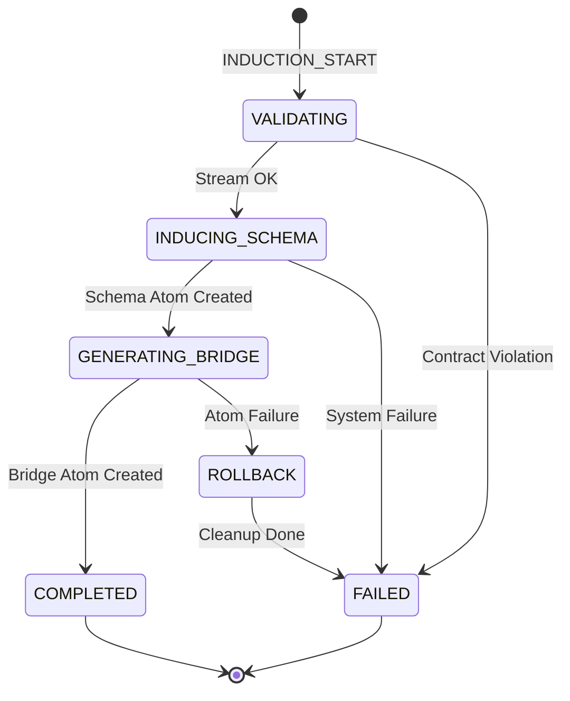

# ADR_020: INDUSTRIAL_INDUCTION_ENGINE (Generación de Realidades)

> **Versión:** 1.0 (Cristalización de la Fase 1 y 2 de Industrialización)
> **Estado:** VIGENTE — Documento de Referencia Crítica

## 1. Contexto y Problema
Históricamente, la creación de puentes (`BRIDGE`) y esquemas (`DATA_SCHEMA`) en INDRA requería una intervención manual significativa por parte del usuario, actuando como un "Ingeniero de Instalaciones" para conectar campos de Notion con la lógica interna. Este modelo no escalaba para un despliegue masivo (Beta Program) y generaba **entropía semántica** (colisiones de nombres).

## 2. Decisión Arquitectónica
Se establece la **Capa de Inducción Industrial**, un sistema de auto-generación de átomos que automatiza la conversión de fuentes externas en motores operativos (AEE).

### 2.1 Orquestación de Backend (Soberanía del Core)
La inducción no ocurre en el cliente. Se centraliza en el `InductionOrchestrator.gs` (Core) siguiendo el **Axioma de Sinceridad**:
- **Patrón de Tickets Asíncronos**: Uso de `CacheService` para gestionar estados.
- **Protocolo de Retorno**: Cada paso del ticket devuelve metadatos canónicos.

#### Diagrama de Estados de Inducción (Mermaid)

### 2.2 Desacoplamiento de Interfaz (AEE Evolution)
El `AEEFormRunner` se refactoriza para ser agnóstico al tipo de dato:
- **ComponentMapper**: Un único punto de registro que mapea tipos semánticos (`IMAGE`, `DATE`, `CURRENCY`) a widgets especializados.
- **Widgets de Frontera**: Los componentes (`widgets/`) realizan su propia validación pre-vuelo, actuando como micro-aduanas locales antes de saturar el puente lógico.

### 2.3 Blindaje Semántico (Anti-Falsos Amigos)
Se impone el **Namespace Scoping Obligatorio**:
- Todo alias inducido automáticamente debe prefijarse con el ID de la fuente: `db_id_normalized_original_field_alias`.
- Esto garantiza que en un `LogicEngine` que consume múltiples fuentes, no existan colisiones entre campos homónimos (ej: "Nombre" en DB1 vs "Nombre" en DB2).

## 3. Axiomas y Restricciones (Suh & TGS)

### A9 — Determinismo de Paridad (Auto-Mapping)
En procesos de inducción automática, el sistema asume una **Relación de Identidad** entre el Alias del Campo y el ID de la Columna externa si sus nombres normalizados coinciden.

### A10 — Soberanía del Manifiesto de Acceso
Todo puente generado vía inducción debe estar firmado con un `ACCESS_TOKEN` para permitir su ejecución en contextos públicos/externos (ADR-019).

### Restricciones Absolutas:
- ❌ **No permitir "Shadow Schema"**: Si el `DRIFT_CHECK` detecta que Notion ha cambiado y el esquema local está desactualizado, el AEE bloquea su ejecución hasta la re-inducción.
- ❌ **No IDs Locales**: El motor de inducción nunca inventa identidades nativas; solo proyecta las identidades del proveedor externo.

## 4. Protocolo de Saneamiento y Rollback (AEE-Homeostasis)
Para evitar la proliferación de **Átomos Huérfanos** (ej: un esquema creado sin su puente correspondiente), el motor DEBE seguir estas reglas de limpieza:
- **Fallo en Bridge**: Si la creación del `BRIDGE` falla, el sistema DEBE intentar la eliminación del `DATA_SCHEMA` recién creado antes de cerrar el ticket como `FAILED`.
- **Fallo en Pin**: Si el anclaje al workspace falla, los átomos deben quedar en estado `STAGED` pero marcados para revisión, o eliminados si el modo es `NON_RESIDUAL`.

## 5. Guía de Generalización de Silos (Sensing Pattern)
Aunque la implementación inicial se centra en Notion, el `InductionOrchestrator` está diseñado como un **Motor Aceptador de Streams**. Cualquier nuevo Silo (Drive, SQL, Airtable) puede integrarse si cumple:
1.  **Protocolo TABULAR_STREAM**: Debe poder proyectar su estructura en el contrato estándar de INDRA.
2.  **Sinceridad de Tipos**: El Silo debe declarar sus tipos nativos para que el `TypeMap` de INDRA pueda traducirlos a tipos canónicos (`IMAGE`, `DATE`, etc.).
3.  **Identidad Única**: Cada registro en el stream debe tener un ID inmutable proporcionado por el Silo.

## 6. Artefactos Involucrados
- `FormRunner.jsx` (Refactorizado: UI elástica).
- `ComponentMapper.js` (Orquestador de UI).
- `induction_orchestrator.js` (Orquestador de Lógica).
- `ResonanceTuningPanel.jsx` (Monitor Unificado de Inducción).
- `ADR_001_DATA_CONTRACTS.md` (Contratos de datos actualizados v3.2).

## 5. Debilidades e ITINERARIO FUTURO (Largo Plazo)

### Deuda Técnica / Limitaciones:
1.  **Caducidad de Caché**: Los tickets de inducción expiran en 6 horas. Procesos de inducción interrumpidos después de este tiempo requerirán un `RESET` total del flujo.
2.  **Dependencia de Red para Drift Check**: El chequeo de deriva estructural requiere conexión activa con el proveedor (Notion). No hay soporte para "Offline Sincerity" fuera de la memoria caché.
3.  **Ambigüedad Visual en Review**: El monitor unificado de `ResonanceTuning` todavía requiere que el usuario "Apruebe" manualmente la inducción. El futuro es la **Inducción Tácita** (Shadow Learning).

### Próximos Pasos (Phase 3):
- Implementar **Rollback Atómico**: Si la creación del `BRIDGE` falla, el sistema debe eliminar automáticamente el `DATA_SCHEMA` huérfano para evitar basura en el Drive.
- **Inducción Tácita** (Shadow Learning): El sistema aprende de la interacción manual del usuario para refinar los esquemas automáticamente.
- **Sincronía con Ignición (ADR-032)**: Se cierra el círculo de soberanía permitiendo tanto la lectura (Inducción) como la escritura (Ignición) de infraestructuras complejas.

---
*Este documento canoniza la transición de INDRA de "Herramienta de Configuración" a "Plataforma de Inducción Industrial".* (Actualizado ADR-032)
