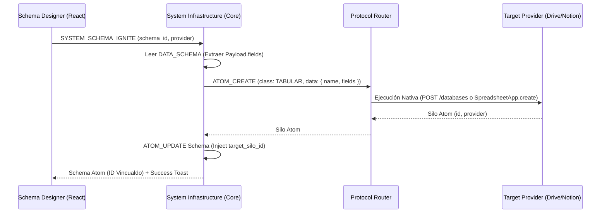

# ADR_032: SCHEMATIC_IGNITION_PROTOCOL (Ignición de Infraestructura)

> **Versión:** 1.0 (Hito de Forward Engineering)
> **Estado:** VIGENTE — Documento de Referencia Crítica
> **Alcance:** Proceso de manifestación de esquemas puros en infraestructuras físicas.

## 1. Contexto y Problema
En el modelo anterior de Indra, el sistema se centraba en la **Inducción** (ADR-020): leer una base de datos existente y generar un esquema. Sin embargo, para una soberanía total del usuario (NOMON), necesitamos el camino inverso: la **Ignición**. El usuario define el ADN en el frontend y el sistema debe ser capaz de "imprimir" la materia (Google Sheets, Notion DB, SQL Table) de forma agnóstica y coherente.

## 2. Decisión Arquitectónica
Se establece el protocolo **`SYSTEM_SCHEMA_IGNITE`**, que actúa como el motor de orquestación para el **Forward Engineering**.

### 2.1 El Axioma de la Manifestación (Idea → Materia)
La ignición no es una simple creación de archivos; es un acto de **Sinceridad Estructural**:
- **ADN (Esquema):** El origen de la verdad. Contiene tipos, etiquetas y alias.
- **Materia (Silo):** El destino físico. Debe reflejar fielmente la estructura del ADN.

### 2.2 Flujo de Datos del Protocolo

### 2.3 Creación Inteligente (Type Mapping)
A diferencia de una creación de archivo plana, la ignición realiza un mapeo de tipos semánticos:
- **Indra `NUMBER`** → Notion `number` / Sheets `setNumberFormat`.
- **Indra `DATE`** → Notion `date`.
- **Indra `SELECT`** → Notion `select`.
- **Indra `BOOLEAN`** → Notion `checkbox`.

## 3. Implementación UI (The Ignition HUD)
El `SchemaDesigner` incorpora un panel de estado dinámico (`SchemaIgnitionPanel.jsx`) que reemplaza el estado vacío del inspector:
- **Estado ORPHAN:** El esquema no tiene territorio físico. Ofrece el botón de [IGNITAR].
- **Estado IGNITING:** Micro-animación de génesis (DNA Pulse).
- **Estado INCARNATED:** El esquema está "Vivo". Muestra el ID del silo y el enlace directo a la materia.

## 4. Axiomas y Restricciones
- **A13 — Unicidad de Materia:** Un esquema solo puede estar ignitado en un silo a la vez. El `target_silo_id` es el ancla de realidad.
- **A14 — Inmutabilidad de Origen:** La ignición no borra datos. Solo crea. Si un esquema ya tiene un ID vinculado, el protocolo de ignición se bloquea para evitar duplicidad de materia.

## 5. Artefactos Involucrados
- `provider_system_infrastructure.js`: Handler de orquestación.
- `provider_drive.js`: Implementación de "Premium Headers" y "Frozen Rows".
- `provider_notion.js`: Implementación de `POST /databases` con mapeo de propiedades.
- `SchemaIgnitionPanel.jsx`: Interfaz de usuario para la ejecución del acto.
- `ADR_001_DATA_CONTRACTS.md`: Actualizado para incluir `fields` en el contrato de `ATOM_CREATE`.

---
*Este documento canoniza la capacidad de Indra para engendrar sus propios universos de datos a partir de definiciones puras.*
